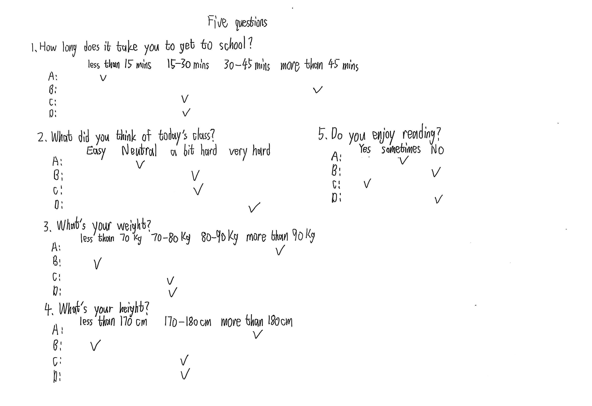
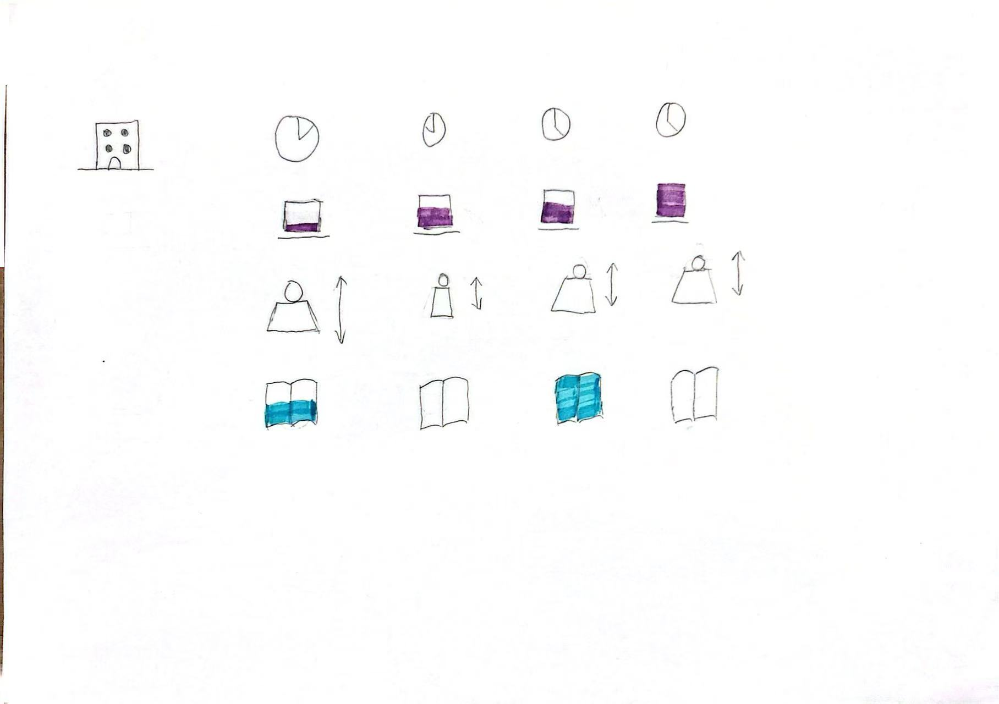
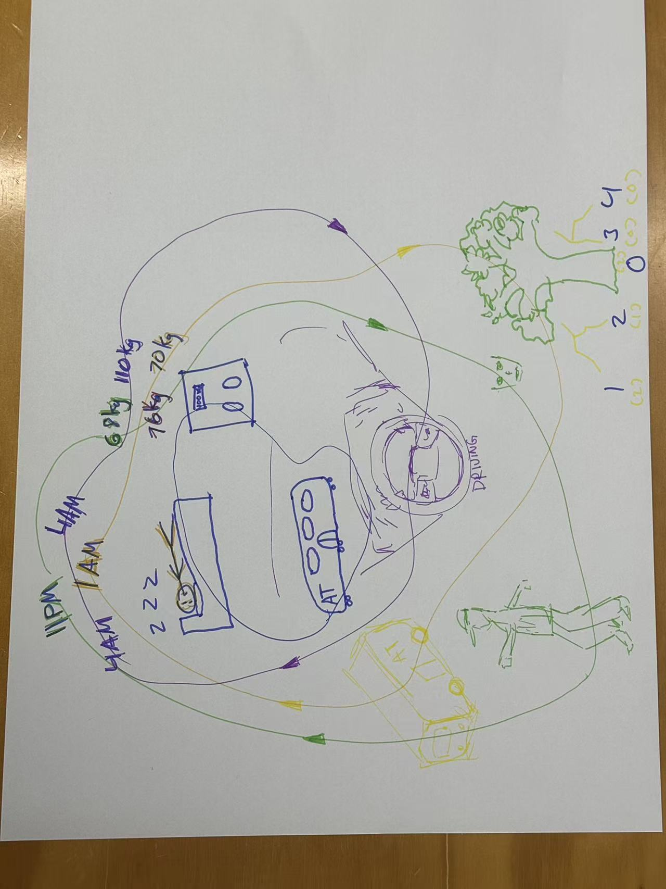
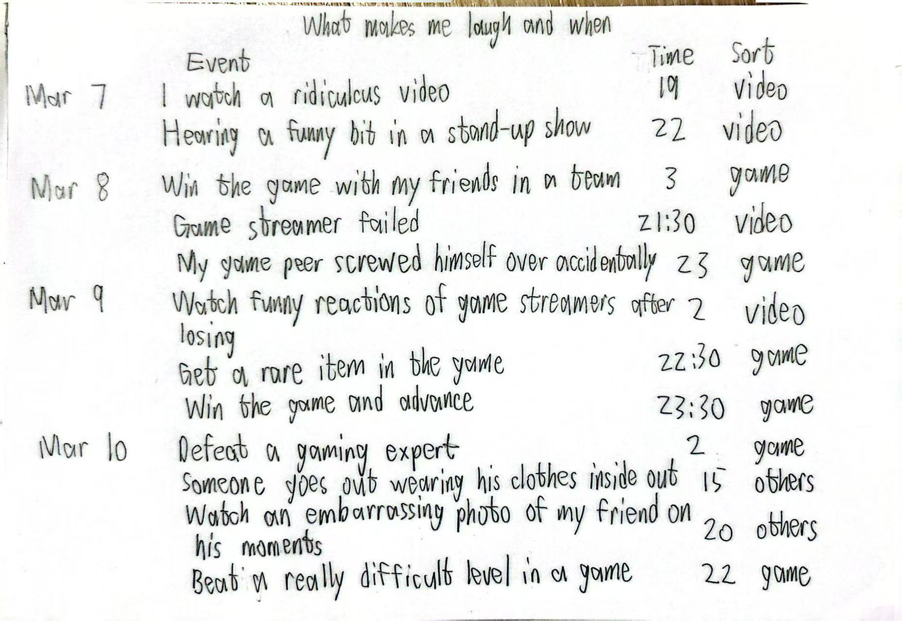
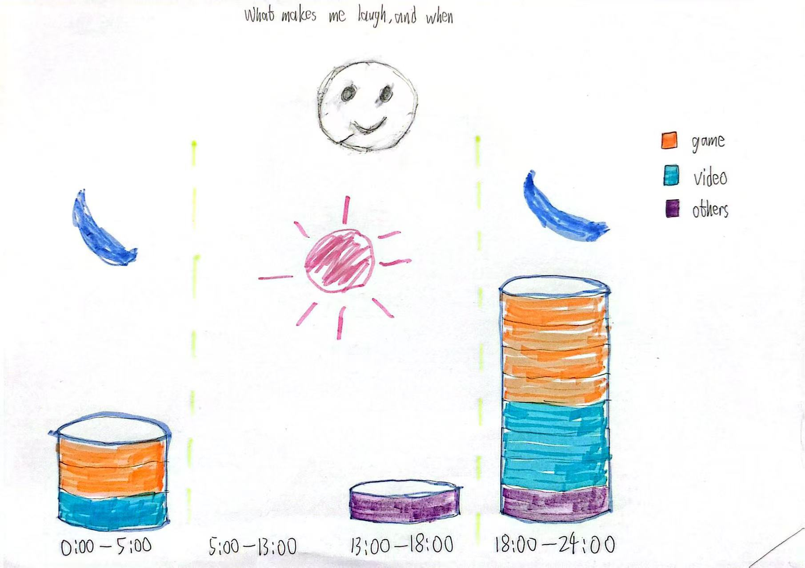

# Week 01

[← Back to Home](../index.md)

## Documentation 
## Experiment 1: Data Drawings

### Group Data Portrait

#### Overview

In a group of 4–5 people, collect personal data from one another and collaborate on a hand-drawn data visualisation to produce a “group portrait” made entirely from data. Groups then swap their portraits and try to decode what each visualisation reveals about the people behind it.

#### Materials

- Paper
- Pens, coloured markers, pencils
- Post-it notes
- Other materials you have to hand

#### Step 1: Collect

Devise a short questionnaire of 5 questions to ask every member of the group. The questions should be personal but low-stakes, and should aim to capture something human and specific (i.e. not just demographics).

Come up with your own questions as a group: what would you like to know about each other?

Each person records their own answers on individual post-it notes. Each post-it should be anonymous (no names).

- 5 questions：

#### Step 2: Visualise

Produce a collective data visualisation on a single sheet of paper.

Represent every group member using the data they collected, without using any names or obvious identifiers.

Invent your own visual language: choose how to encode each data point using shapes, colours, position, scale, symbols, texture, or spatial arrangement. 

The visualisation must include a legend that explains the encoding system.

- Visualisation

#### Step 3: Decode

Swap your data portrait with another group. 

Examine the visualisation you have received.

- Another group：

Work together to write some brief responses to the questions below. Put these on post-it notes attached to the data drawing.

- What can you learn about the people in this group from their data portrait?

From the picture, I can gather some of the daily habits and characteristics of the team members. Different people are represented by different colours. You can see each member’s sleeping habits. Each team member’s commonly used mode of transport is also visible. Each team member's weight represents their physical characteristics.

- What surprised you?

What’s surprise in the image is that most team members go to sleep quite late. Most team members use different modes of transport. Only 2 people use the same mode, which is the bus.

- What questions do you have for them?

Does the tree and the number next to it represent time spent in nature, or the number of times spent in nature?

- Can you tell who is who?

It's difficult to tell who's who because I'm not familiar with the other team members' habits.

### Independent Data Portrait

#### Overview

Create your own data portrait: a hand-drawn visualisation of personal data collected over several days.

#### Step 1: Choose a topic

Pick an aspect of your daily life that you are curious about but don't normally pay close attention to. It should be something you can observe and record by hand over the course of 4–5 days. 

I choose "What makes me laugh, and when"

#### Step 2: Collect data by hand

Carry a small notebook, use the back of a receipt, or whatever is convenient. Record your observations as they happen. 

Don't rely on apps or digital tools. The act of noticing and writing things down is part of the exercise. 

Be as specific and honest as you can. Include details that feel imperfect, ambiguous, or hard to categorise.

- Record:

#### Step 3: Design your visualisation 

After your collection period, create a data drawing on one side of A4 card. 

Invent a personal visual language: use colour, shape, position, pattern, size, and texture to encode different aspects of your data. On the reverse side, draw a legend that explains your visual system.

- Visualisation:

#### Document your process 

To capture the full scope of your practice, each entry in the Making Journal must include a mix of visual and textual evidence, such as sketches, screenshots, GIFs, diagrams, process notes, instructions and reflections.

I choose to track 'what makes me laugh, and when'. I chose this topic because collecting data in daily life feels easy. I'm a bit introverted and not laugh often. So I know the data won't be too much or too messy. This makes it easier for me to visualise in the future. I am also curious about those small moments that truly make me laugh, because I don't always notice them.

Collecting this data has made me pay more attention to my daily life. Sometimes I laugh so hard that I almost forget to write it down. When I was tracking it, I had to care for those small moments. At first, it was a bit difficult, but after a while, it became a habit. When visualization is needed, I have to consider how to display data clearly. I use a simple table to record things that make me laugh. It feels great to turn my real-life moments into a painting.

Before this project, I thought I was a very serious and rarely laughed. But after collecting the data, I realised that I was laughing more than I had imagined. Sometimes I laugh a few times. I have noticed that I laugh the most when I watch interesting videos or when I see my friends doing something foolish, such as tripping or making funny faces. I also noticed that most of my laughter occurs at night, after I finish assignments. To make visualisation easier, I grouped laughter by time zone. This showed me a result that I didn't expect.

I made a simple table to record the time and events I laughed during the day. This helps me see which times of the day I am most relaxed and what kind of things trigger my laughter. For example, I have found that evenings and interesting videos are important components of my laughter. But I overlooked one thing, which is how many times I laughed every moment. Sometimes I only laugh once, sometimes I laugh many times in a row. But the data I recorded did not show the intensity of my laughter.

This exercise focuses on individual experiences, so it is related to data humanism. Data humanism is about bringing human emotions and their corresponding meanings back to data. The Dear Data project is a project in which two designers record and express personal data by hand drawing. My project is very similar because the laughter I collected is some very humanized data and was hand drawn. This is not just cold numbers, but using data to help me better understand myself. I used to laugh often too
