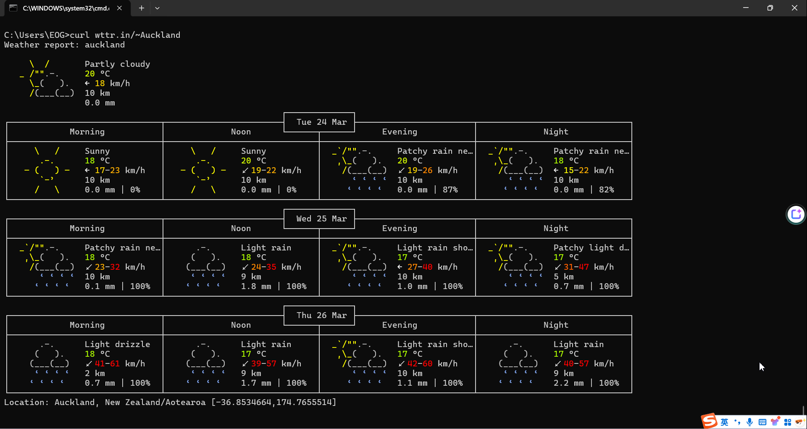
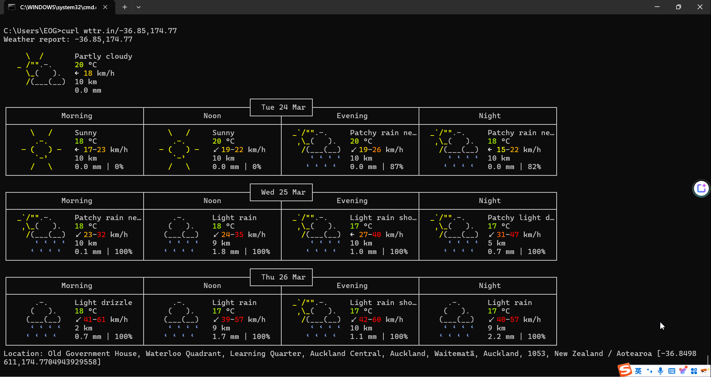
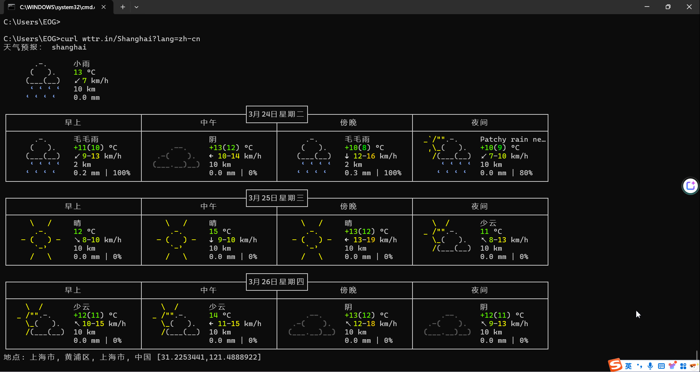
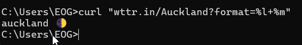
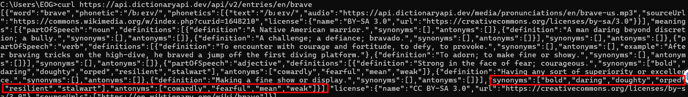
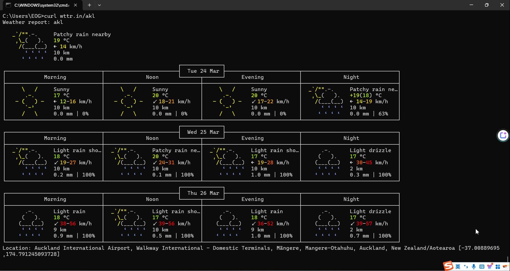
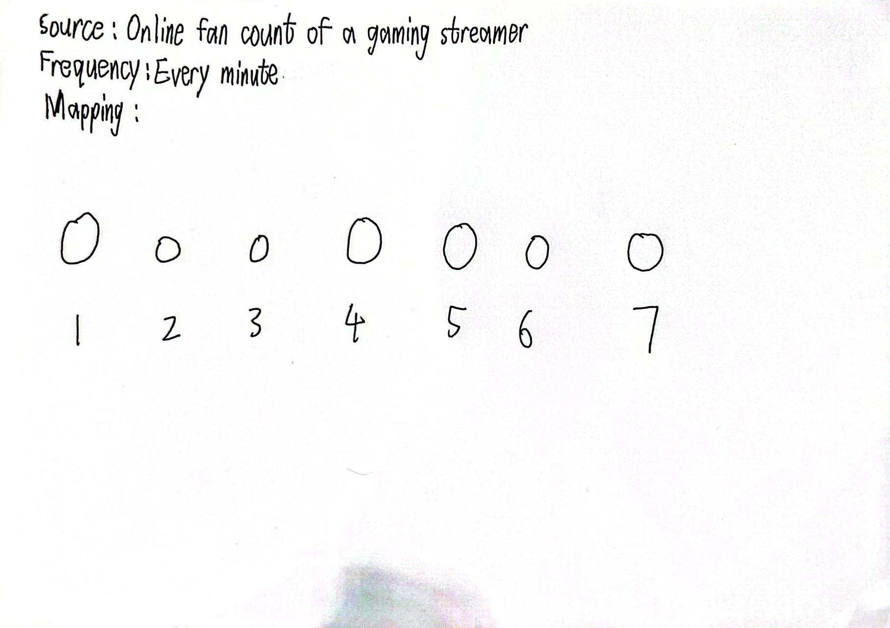

# Week 03

[← Back to Home](../index.md)

# Experiment 3: Live Data

## In-Class Activities

Overview

Through digital and analogue approaches, explore how to access, filter, and translate live data into visual and material forms. These activities build on the coding fundamentals from Experiment 2, while also introducing analogue practices rooted in rule-based and generative design.

### Activity 1: Explore with cURL

Using your terminal and the documentation / GitHub repos for wttr.inLinks to an external site. and the Free Dictionary APILinks to an external site., try to figure out how to:

- Get the weather for a location using its GPS coordinates

  *Get the geolocation results of looking up the location.*
  

  *Get the weather using its GPS coordinates.*
  

- Get the weather in a different language

  

- Get the current moon phase

  

- Look up the synonyms and antonyms of a word

  

- Find something else in the documentation that we haven't covered

  *Get airport weather report by Using 3-letter airport codes.*

  

### Activity 2: Weather Visualisation

Open the demo sketchLinks to an external site. in the p5.js web editor. This sketch uses the Open-Meteo APILinks to an external site. to fetch current weather data for Auckland and map it to visual properties.

Experiment with the sketch:

- Change the latitude and longitude to a different city and observe how the sketch changes.

- Use the data to control different visual properties: colour, position, size, number of shapes.

- Add more weather variables from the Open-Meteo docs to the API URL.

- Try using random() or noise() alongside or instead of the live data.

- Use vibe coding to try something more ambitious.

- Use print() in the console to check the range and scale of values before trying to visualise them.

*I choose Shanghai and its latitude and longitude is (31.22,121.46).*

<iframe 
src="https://editor.p5js.org/yuhaochen018/full/2ibqwt2Jc"
width="420"
height="440">
</iframe>

### Activity 3: Design and Execute a Data Protocol

In pairs, design a data protocol: a set of rules for translating a live data source. This is the analogue equivalent of an API: a defined set of rules for requesting and receiving data.

Your protocol must specify:

Source: Online fan count of a gaming streamer

Frequency: every minute

Mapping: how to record each observation as a mark, shape, or action

## Independent Study: Live Data Visualisation
Overview

Building on the in-class activities, create a work that engages with live data (data that is ongoing and changing). You can either take a digital approach, or an analogue/physical approach.

*I choose digital approach.

Option A: Digital

Build a p5.js sketch that responds to live data.

Use an API to bring external data into your sketch. The Open-Meteo APILinks to an external site. (weather) and the ISS Location APILinks to an external site. (International Space Station position) are good examples, as both are free and require no account or API key. However, for this task you must find your own API to work with.

Consider:

How do you map data values to visual properties (colour, size, position, shape, movement)?
What does the visualisation reveal about the data that numbers alone cannot?
How does the sketch change over time? What is the relationship between the data's rhythm and the visual rhythm?
Use the p5.js referenceLinks to an external site. and tutorialsLinks to an external site. to learn new techniques. You could also use LLMs to help you build features beyond what was covered in class. Make sure to document your process and explain what you learn.

<iframe 
src="https://editor.p5js.org/yuhaochen018/full/7r-sKL7uS"
width="420"
height="440">
</iframe>

Include reflective writing that addresses the following:

Did you take a digital or analogue/physical approach? Why?
What live data source did you work with, and how did you access it?
How did you decide on the mapping between data and visual/material form?
What does your work reveal or communicate about the data?
Did you use vibe coding, LLMs, or other tools in your process? What did you learn?
How does your work relate to the practitioner examples discussed in class (e.g. David Bowen, Conditional Design, Nathalie Miebach)?
What would you develop further with more time?
Any other reflections?

