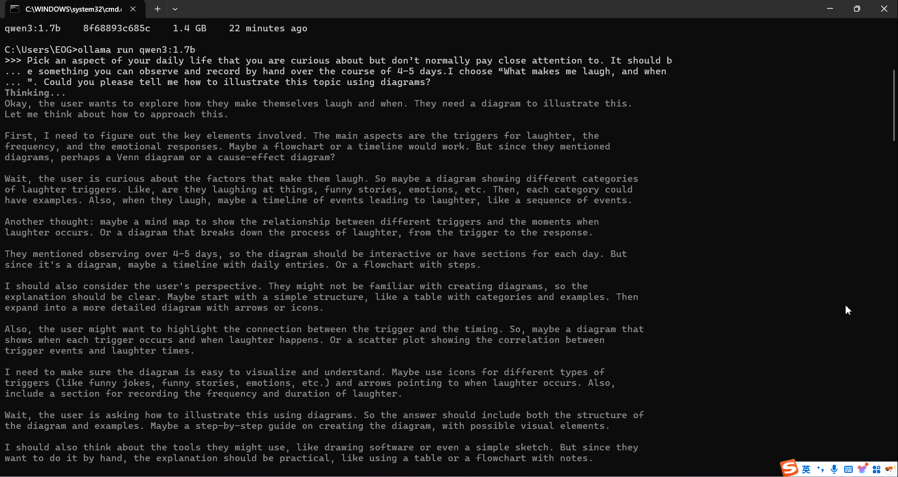
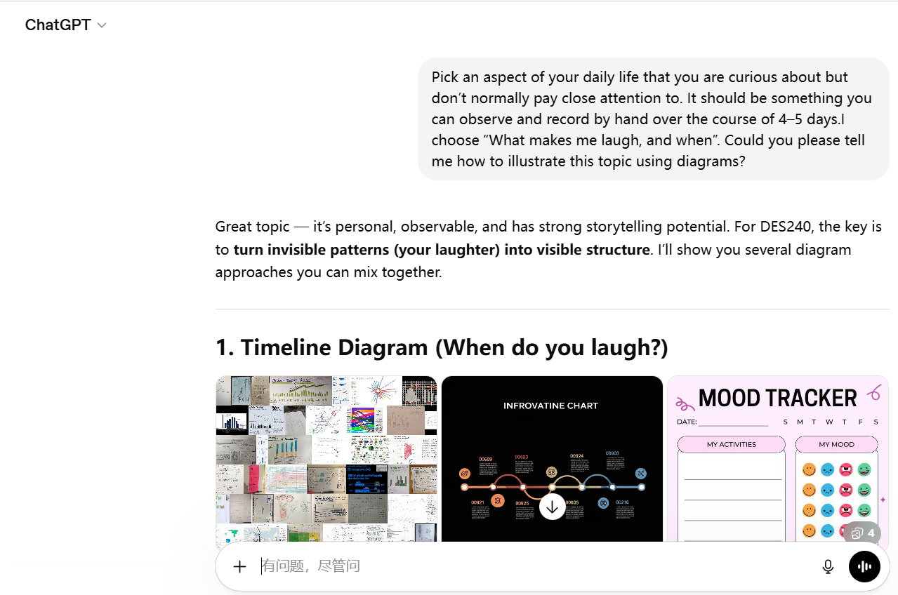
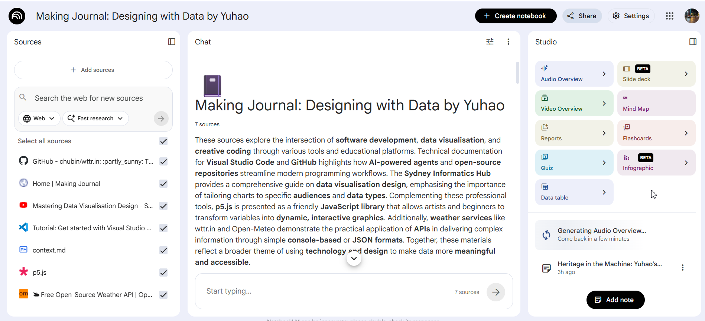
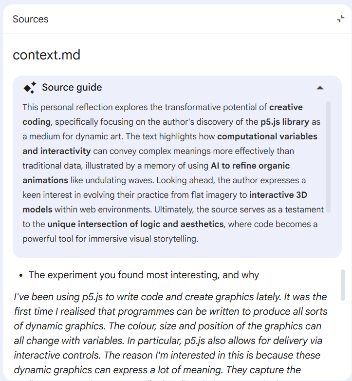

# Week 04

[← Back to Home](../index.md)

# Experiment 4: Artificial Intelligence

# In-Class Activities
Overview

Explore local and cloud-based AI workflows. These activities introduce the practical and ethical dimensions of working with AI, building on the ideas about data representation from previous experiments.

## Activity 1: Local AI with Ollama

Download and install OllamaLinks to an external site., then open your terminal. Download a small model:

ollama pull qwen3:1.7b

Once downloaded, start a conversation:

ollama run qwen3:1.7b

Spend 10 minutes exploring. 

*I describe data from a previous experiment and asking for visualisation ideas.*

*Ollama gives me the answer.*

*I put the same prompt on Chatgpt and give the following answer:* 

*I tried to have these two AI write the same prompt code separately. The result is similar to the above.*

*Compare these two AI tools. In terms of speed, Ollama describes its thought process continuously, and then provides a result after a long time. ChatGPT gives the result directly and is much faster. Regarding quality, Ollama offers suggestions, all in text form, which are useful but not intuitive for graphic design. The code is also in Python, and p5.js can't be used directly. ChatGPT not only provides text descriptions, but also many graphical demonstrations. Moreover, the code it provides can be used directly. In terms of the trade-off between sovereignty and capability, Ollama doesn't require any network connection, and its thought process is completely transparent. The prompts I write are entirely my own. ChatGPT, on the other hand, is the opposite; all prompt ideas become part of the computational resources that are shared.*

## Activity 2: Cloud AI with NotebookLM

Open NotebookLMLinks to an external site. with your University Google account and create a new notebook.

1. Build your notebook:

Add sources that represent your experimentation so far on the course. Mix your own work with other sources: your Making Journal URL (GitHub Pages), practitioner websites that resonated with you, data sources or APIs you are curious about, and other creative work you have made or are interested in.

2. Frame your research:

Before generating artefacts, add a short document to shape the AI's focus. Open a text editor and write three sentences: 

- The experiment you found most interesting and why.

*I've been using p5.js to write code and create graphics lately. It was the first time I realised that programmes can be written to produce all sorts of dynamic graphics. The colour, size and position of the graphics can all change with variables. In particular, p5.js also allows for delivery via interactive controls. The reason I'm interested in this is because these dynamic graphics can express a lot of meaning. They capture the audience's attention more easily than linguistic or numerical representations.*

- A theme or idea you keep coming back to.

*I vividly remember one occasion when I finished writing a p5.js graphics code. After finishing, I had a sudden idea to ask AI to help me see how it could be improved. The AI transformed my graphic representing water into the shape of a wave, with the seawater constantly undulating. The colour also changed with the undulation of the seawater. I was amazed by the power of this kind of graphics code.*

- Something you're curious about but haven't had a chance to explore yet. 

*I've seen that p5.js has 3D models, but I haven't had time to try them yet. I will definitely explore using code to create 3D graphics when I have the opportunity. Although this method of creating 3D graphics is not as efficient as using 3D software, the ability to display dynamic 3D graphics on a website with interactive controls still feels different.*

3. Explore in the chat:

Use the chat to ask questions about your sources. 

*I ask the question: "If my sources were documentation for a design project, what would the final outcome be?"*

*NotebookLM analysed the Sources I provided and offered suggestions in four areas: Data Source and Integration, Technical Execution, Technical Execution, and User Interaction and Medium. It also gave me questions about what I might need to understand further.*

4. Generate the Audio Overview:

Find the Audio Overview option and generate it. Once it's ready, listen with headphones. While you listen, make notes: 

- what did it pick up on that surprised you?

*This NotebookLM audio is produced as a podcast by a man and a woman. It covers all the content I submitted in the conversation, with the content arranged in an orderly manner, starting with the role of data presentation and progressing step by step. It discusses data sources, data processing, and data presentation one by one. It specifically mentions that the same statistics can present different raw data. Raw data doesn't lie, but statistics may obscure many real situations.*

- What did it get wrong? 

*It's not exactly wrong. The audio mentions using VS Code for data processing. While I did use VS Code, it was only as a text editor, and not for data processing.*

- How does hearing your work discussed feel different from reading the chat responses?

*I no longer feel so alone in my work, someone has validated my efforts. It makes me feel like my graphic design ideas are being recognised. Based on my design ideas, the audio team gave me a lot of suggestions. They also explained the characteristics of the websites I provided as resources, helping me understand how to use them effectively. At the same time, based on my content, they pointed out that visualising the original data, while looking aesthetically pleasing, isn't the main focus; the priority should be that the audience can quickly understand the data being presented through the graphics. This helped me realise the power of human intuition in charts and graphs, and that designers should learn to harness this intuition.*

# Independent Study: AI-Assisted Data Exploration
Overview

Choose a public dataset about life in Aotearoa New Zealand and use cloud-based AI tools to explore, interpret, and represent the data. The challenge is to go beyond a single prompt, working through sustained dialogue with the AI, directing its decisions, and critically evaluating its outputs.

Step 1: Find a Dataset

Browse the open data catalogue at catalogue.data.govt.nzLinks to an external site. and find a dataset that interests you. Look for something with a downloadable CSV file that is small enough to upload into a cloud AI tool (aim for under 10MB, or a few thousand rows).

Choose something you find genuinely interesting. The data should relate to a real aspect of life in Aotearoa that you would want to explore further.

Step 2: Understand the Data

Upload your CSV into a cloud AI tool (e.g. CoPilot, Gemini, NotebookLM, ChatGPT) and have a conversation about it. Ask the AI to explain what is in the dataset: what the columns mean, what the values represent, how much data there is, and what is missing or incomplete.

Consider:

What stories might this data contain?
What questions could it answer?
What biases or gaps are present?
Who collected this data, and for what purpose?

Step 3: Design Multiple Representations

Ask the AI to produce a visualisation of the data, but don't accept the first output. Direct the AI: specify the form, the visual encoding, the audience, the story you want to tell. Iterate through at least three distinctly different representations of the same data. These could be code-based (e.g. p5.js or HTML), textual, visual, or even prompts for physical/analogue translations.

For each version, make deliberate design decisions about what to change. You might vary the format (chart, map, interactive page, narrative text), the visual encoding (colour, size, position, shape), or what subset of the data to foreground.

Step 4: Critically Evaluate

Look at the representations you've produced and reflect on the AI's design choices:

What did the AI default to? (e.g. bar charts, blue colour schemes, generic titles)
What did you have to override or redirect?
What assumptions did the AI make about the data or the audience?
Which representation is the most interesting, and why?
What would you do differently if you were building this without AI?
Document Your Process
To capture the full scope of your practice, each entry in the Making Journal must include a mix of visual and textual evidence, such as sketches, screenshots, GIFs, diagrams, process notes, instructions and reflections.

Items on the course Reading List for this week include the introduction to Data Feminism by Catherine D'Ignazio and Lauren F. Klein, and a talk by Kirikowhai Mikaere on Māori data sovereignty. Engage with both of these and draw on them in your reflections.

Include reflective writing that addresses the following:

What dataset did you choose, and why?
How did AI tools help you understand the data? What did they miss?
What design decisions did you make in directing the AI, and what did you learn from this process?
How do the different representations of the same data change what a viewer might understand?
What questions do D'Ignazio and Klein's ideas raise for your work with this dataset?
How does Mikaere's framing of data as a strategic asset for Māori development challenge or inform how you think about the dataset you chose?
What was your experience of working with AI as design tool?
What would you develop further with more time?
Any other reflections?

# References

  OpenAI. (2026). ChatGPT (Mar 28 version) [Large language model]. https://chat.openai.com/chat

  OpenAI. (2026). Ollama (Mar 28 version) [Large language model]. https://ollama.com
