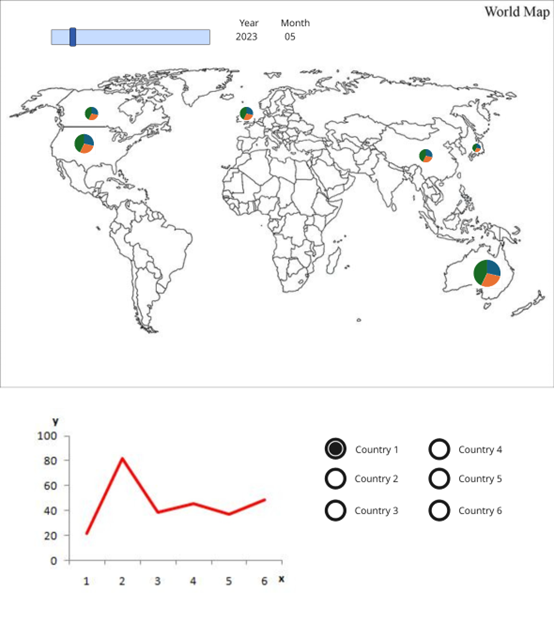

# Week 05

[← Back to Home](../index.md)

# Reflective Proposal

## Review and Reflect

*Over the past four weeks of study, I have most enjoyed using p5.js to make dynamic graphics. These visuals are more engaging for the reader compared to text. Going forward, I’d like to visualise everyday data, such as turning traffic, weather, and environmental information into graphics. Ideally, these everyday graphics would have interactive features to let users access the information they’re interested in. During the four weeks of practice, I shared my ideas with my peers via messaging apps to get their feedback. I hope the project will be a dynamic, interactive graphic. The interactive controls should include sliders and dropdown menus. Users can select different times using the sliders and choose different query objects using the dropdown menus.*

## Thematic Focus and Data Source(s)

*I’ve explored many data sources, including various dynamic APIs and static data tables. Ultimately, I choose tourist arrivals data to understand the number of tourists visiting NZ from different countries. By analysing the number of tourists arriving from key source countries across different time periods, I aim to visualise these changes on a world map. In the future, this dynamic map could illustrate how rising global oil prices affect the number of visitors to NZ from its primary source countries. To achieve this, three sets of static data are required. First, tourist arrival data, which can be received from Stats NZ, although the statistical reports acquired will need to be processed. Second, the central location information for the main inbound tourist countries, which can be recorded into a separate table. Third, a world map, obtainable from Geojson maps website. Changes in tourist arrivals from major countries can be used to assess the impact of rising oil prices on different regions in the future. Presenting this data visually will let readers appreciate the data’s impact more intuitively.*

## Visualisation & Impact

*I want to make two graphics areas, one above the other. The top graphics area will display a world map showing the number of tourists arriving from major countries, categorised by month, and displayed as circles. The purpose of their visit, based on Stats NZ data (work, tourism, visiting friends and relatives), will be represented by three different colours. The tourist data table contains the latest data from February 2023 to January 2026, a total of 36 periods. A scroll bar will allow users to display different periods. The bottom chart area will be a line graph where users can select one or more countries to display data changes over the last 3 years. See the image below for the specific style.*

 *My idea*

*Tourism has always been one of NZ’s main industries. From my graphs, professionals in this industry can understand where tourists are coming from, enabling them to design targeted service products to meet tourist needs. Industry researchers in NZ can observe the structure of international tourists and formulate relevant policies to promote the economic development of the industry. The changes in tourist numbers from different countries at different times can be used by tourism professionals to develop marketing strategies corresponding to different regions.*

