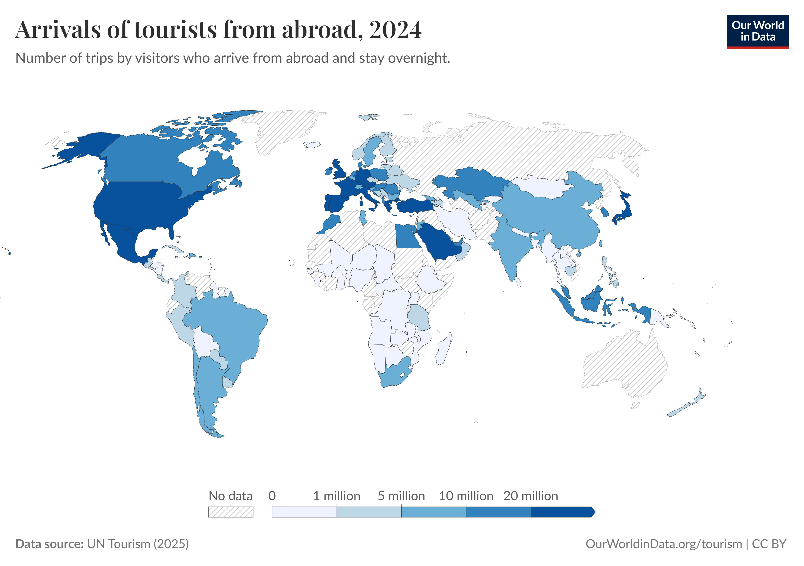
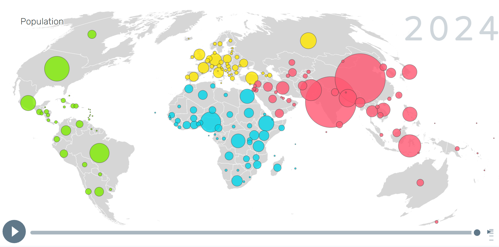
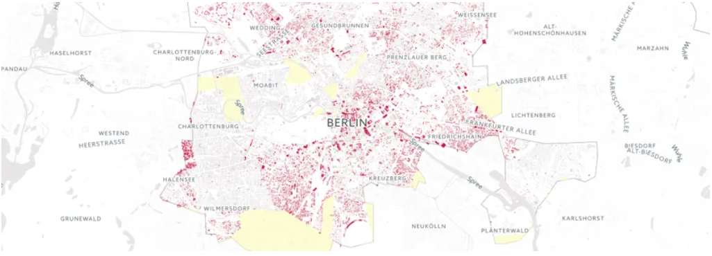
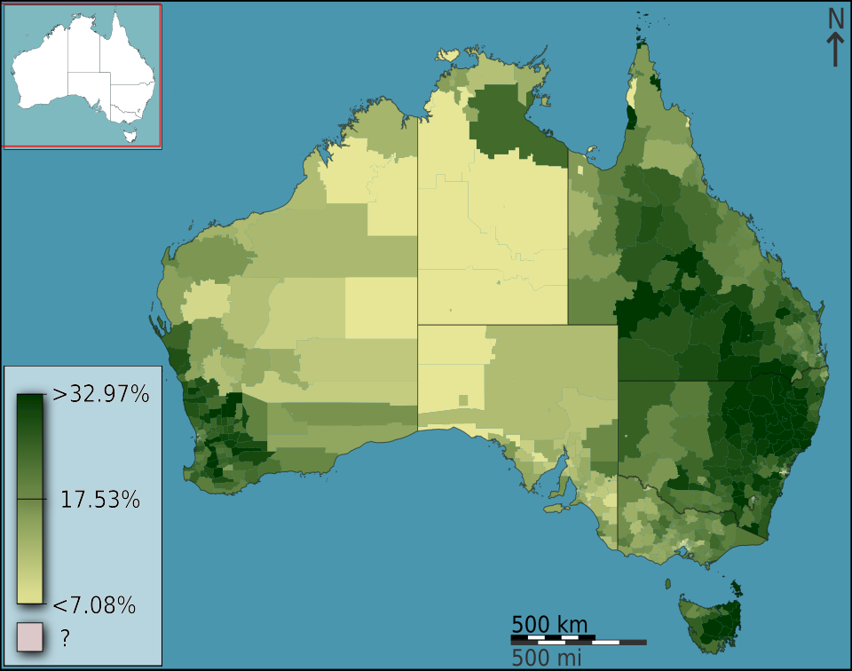
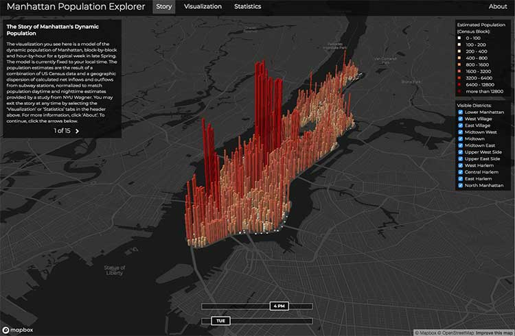
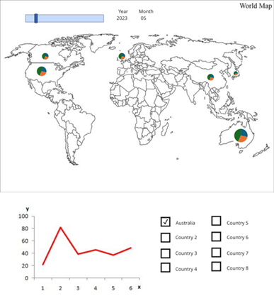

# Week 06

[← Back to Home](../index.md)

# In-Class Activities 

## Data Exploration

This project uses three data sources to illustrate the visitor patterns of international tourists to NZ The primary data source is the Infoshare database from Stats NZ. This dataset records the number of inbound tourists from eight major source countries (Australia, China, Japan, South Korea, Germany, the United Kingdom, Canada, and the United States). The data spans from February 2023 to January 2026 and is categorised monthly. Furthermore, the data classifies visitor purpose into three categories: business, holiday/vocation, and visit friends/relatives. Currently, this dataset is presented in the form of a pivot table, with time arranged in rows and countries and purpose in columns and needs to be converted to a flattened format for use in p5.js.

The second dataset contains central location data for each country, including latitude and longitude coordinates. This information was manually collected and organised into a simple CSV file. The third dataset is a world map in GeoJSON format, sourced from https://geojson-maps.kyd.au/, which provides the geographical boundaries used for visualising the data.

The main data has limitations. It only provides data for eight countries, which introduces bias by excluding smaller or under-represented countries.

## Visual Research and Precedent Study

### Tourism (Our World in Data)

Arrivals of tourists from abroad, 2024 (Our World in Data, n.d.).

Reference:

Our World in Data. (n.d.). Tourism. https://ourworldindata.org/tourism

This map uses varying shades of blue to represent the differences between countries, making the global tourism landscape clear briefly. I can use these varying colour intensities to reflect differences in the number of tourists. This aligns with my idea of using a world map and prompts me to think more carefully about visual hierarchy.

### Population (Maps)

Population 2024 (Gapminder Foundation, n.d.).

Reference:

Gapminder Foundation. (n.d.). Map. https://www.gapminder.org/tools/#$chart-type=map&url=v2

These dynamic bubbles make the data appear lively. I want to represent the data values through the size of the bubbles. I’ll add a time slider interactive feature to perfect my project.

### Dot distribution map

Dot distribution map in Berlin (CARTO, n.d.).

Reference:

CARTO. (n.d.). 80 data visualization examples using location data maps. https://carto.com/blog/eighty-data-visualizations-examples-using-location-data-maps/

I like using circles to represent data size, as this creates a clear visual impact. I’ll use circles placed on countries, with the size of the circle representing the number of visitors. This aligns with my idea of using circular icons rather than solid areas.

### Choropleth map

A choropleth map that visualizes the fraction of Australians that identified as Anglican at the 2011 census (Wikipedia, n.d.).

Reference:

Wikipedia. (n.d.). Choropleth map. Wikipedia. https://en.wikipedia.org/wiki/Choropleth_map

Colour gradients make data differences stand out clearly. I might use varying colour depths to represent different categories. That makes me think about combining colour with circle size, it might express things more clearly.

### Interactive map dashboards

The invisible heartbeat of New York City (Tableau Software, n.d.).

Reference:

Tableau Software. (n.d.). 10 examples of interactive map data visualizations. https://www.tableau.com/learn/articles/interactive-map-and-data-visualization-examples

This temporal interaction allows users to explore data in multiple ways. I’d like to add a hover interaction feature that displays detailed information such as the number of visitors for different purposes and their proportions. I will design the project to be more interactive, rather than a static chart.

## Project Planning and Skills Roadmap

I want to create an interactive NZ tourist statistics chart using p5.js. The upper part displays a world map showing visitor data to New Zealand from eight major countries. Each country is represented by a circle located at its geographical centre. The size of the circle represents the number of tourists, and the three colour blocks on the circle represent the number of tourists for different purposes. Users can view changes in monthly data via a time slider. The lower part uses line charts to show changes in the number of tourists from different countries, selectable via checkboxes.

I need to learn:

How to load data table and GeoJSON in P5.js.

How to convert latitude and longitude into screen coordinates and draw world maps.

Use createSlider() and createCheckbox() to control time and filter data.

How to display the data using P5.js.

The next steps involve preparing and cleaning the dataset for use in p5.js. Visitor data from Stats NZ (Statistics New Zealand) needs to be converted from a pivot table into a flattened format, and categorised by country, month, and purpose. Following this, I will gather the coordinates for the central locations of 8 countries. Simultaneously, I'll ensure the consistency of country names across all datasets.

Once the data is prepared, I will begin constructing the base map using a GeoJSON file, and test how to draw it correctly in p5.js. After the map is running properly, I will add circles to represent visitor numbers, and experiment with using different colour classifications to represent the number of visitors for different purposes of visit. I also want to use line graphs to show changes in visitor data for each country.

Next, I will implement interactive features such as a time slider and checkboxes for filtering different countries. Subsequently, I'll test the visualisations to check their readability and ease of use, optimising them through iteration. This includes adjusting colour choices, circle sizes, and interaction behaviours.

# Independent Study

## Consultation Reflection

During the proposal consultation, I outlined my project goals, vision, and data sources, including the use of tourism arrival data from Stats NZ, and my initial visualisation plans using p5.js. The tutor gave positive feedback and showed interest in the topic. This reassured me that my design direction was correct and gave me more confidence to continue. While no major changes were suggested, the discussion helped me confirm that the idea was appropriate and practical.

The exchange also helped me clarify the specific implementation of the visualisation scheme. I explained my plan to create an interactive map showing the number of tourists from eight countries, using the size and colour of circles to represent different data values. I also mentioned adding a time slider to show monthly changes, and a line chart below the map to present time trends. Exploring these ideas helped to clarify the project goals and data structure.

In the subsequent development of the project's visualisation and interactive features, I will pay more attention to visual effects, making the data easier for readers to understand, and ensuring the interactive functions support in-depth data exploration.

## Technical Skill Building

The technical gap I am concerned about is learning how to clean the original data. I need to change it into a CSV format and upload it in p5.js.

I need to understand the loop statements, scripts and parameters in p5.js. I want to know about variables and how to use them.

I first downloaded a world map file in GeoJSON format and placed it in my project folder. I use the loadJSON() function in p5. js to load files in the preload() function. Then, I learned the structure of GeoJSON files and learned how to locate graphic coordinates.

Through this process, I learned the structure of GeoJSON data and how to determine geographic coordinates.

## Initial Concept Sketch

