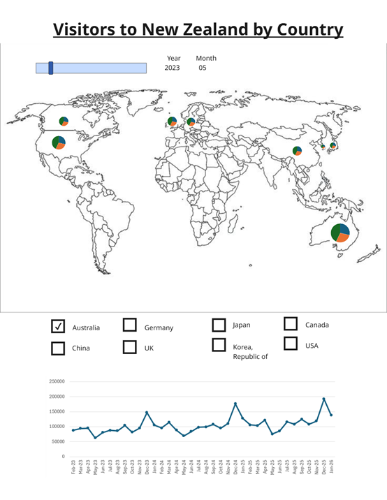
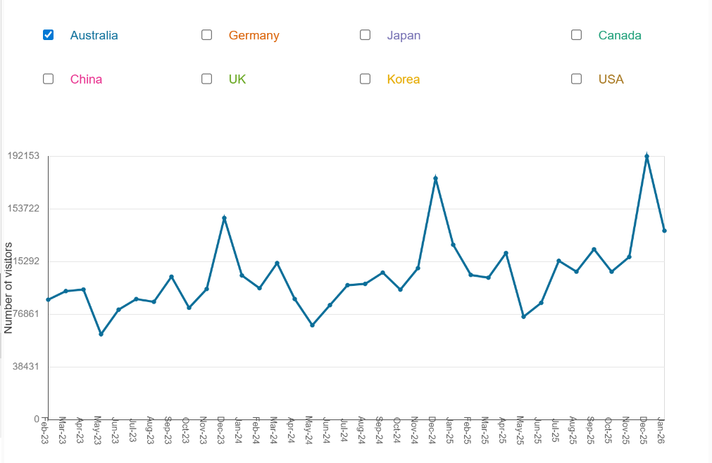
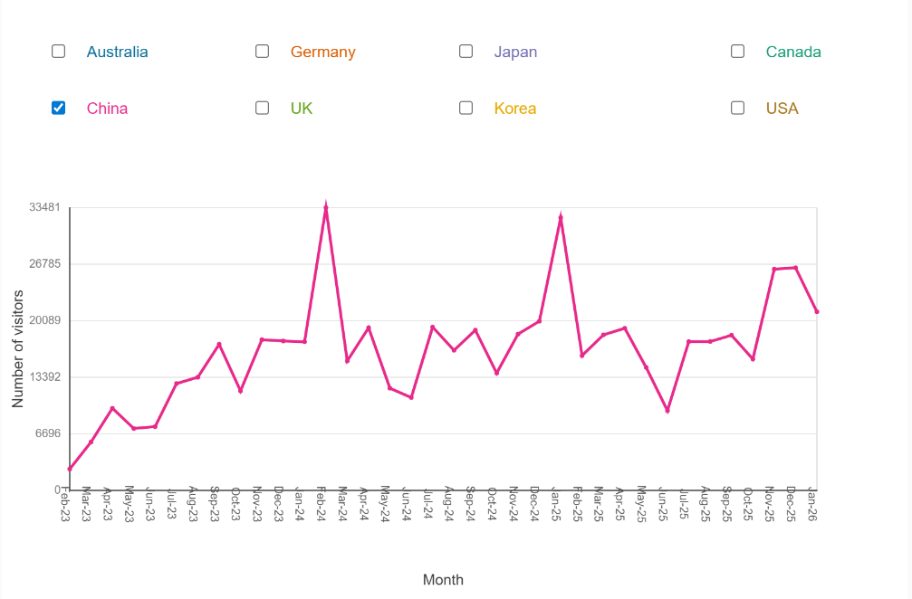
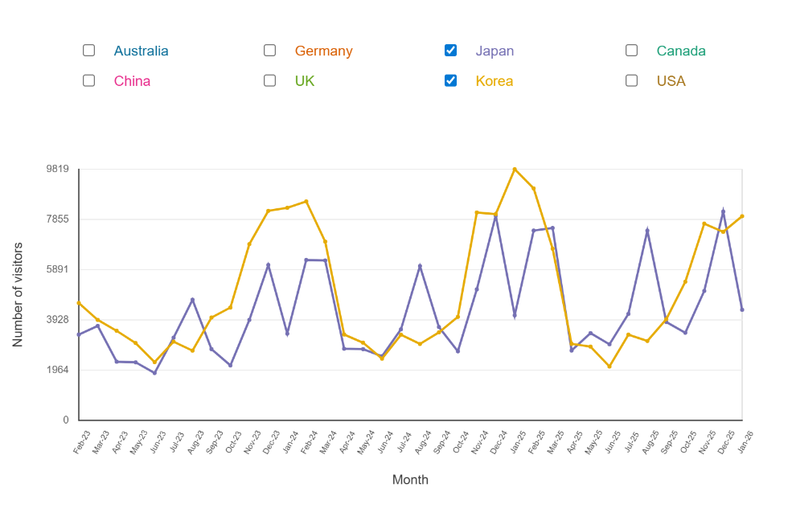

# Week 07

[← Back to Home](../index.md)

# In-Class Activities 

## Concept Sketche

Feedback I received：

*The map with pie charts looks clear and easy to understand at first glance.*

*Why did you only choose 8 countries? Are they the top visitors or random?*

*The slider for time is a good idea. It helps show change over months.*

*In the line chart, how can I tell which line belongs to which country?*

*Using pie charts to show different purposes is interesting.*

*Why not use a dropdown menu instead of checkboxes to select countries?*

*Australia has a much bigger pie chart. It shows strong comparison.*

*The layout of the map on top and chart below is easy to read.*

*What is the focus of your design? Comparison between countries, or change over time?*

What surprised me

I was surprised that the line chart make people confused about. They could not clearly see which line belongs to which country. Some people questioned why I only selected 8 countries. I realised this was not clearly explained in my design.

What aligned with my ideas

Some peers said the map and pie charts are clear to understand. This matches my idea of showing data visually and simply. They also liked the time slider, which supports my goal of showing change over time.

What I want to follow up

I want to improve how users read the line chart. I also want to explain the country selection more clearly. 

Revised my sketch

I use different colors to represent different countries on the line chart and checkbox. This helps users quickly understand the lines.

I will add a short note ‘These are the top 8 visitor countries to New Zealand.’

## Making Sprint

I develop the line chart in this making sprint. According to the feedback, I wanted to make the data easier to read. In this experiment, I used different colours for each country line and checkbox.

Step 1, I cleaned the original data which downloaded from Stats NZ. The original data was in a pivot-table style, so it cannot be used in p5.js directly. I changed it into a CSV format, with columns such as country, month, purpose, and visitor number.

Step 2, I used an Excel pivot table to reorganise the cleaned data. I grouped the data by the same country and the same month. Then I added the different goals’ visitors. This helped me create a new CSV file for the line chart.

Step 3, I imported this new CSV file into p5.js. I wrote a clear prompt for ChatGPT, explaining the layout, chart position, country colours, checkbox positions, and what I wanted the line chart to show. I finished my first line chart prototype.

<iframe src="https://editor.p5js.org/yuhaochen018/full/kQTizmEBf" width="800" height="600"></iframe>

Programe by the prompt (OpenAI, 2026).

## 'What if' Variations

Three suggestions:

What if the chart was centred better? The whole chart looks slightly left, and some labels overlap.

What if the spaces between the checkboxes are not same?

What if the line chart includes a label next to the lines, so users don’t need to guess which line is which?

I choose 'What if the chart was centred better? The whole chart looks slightly left, and some labels overlap.'

My plan:
I will move the whole chart slightly to the right.

The Y-axis title ‘Number of Visitors’ overlaps with the axis numbers. I’ll move the label further left and reduce font size.

The date labels are too high, and the axis title is too low to read. I’ll move date labels slightly down and move axis title closer to the axis.

# Independent Study

## Project Development & Skill Building

The date labels need to move lower. The X-axis title needs to be moved closer to the axis. The spaces of the checkboxes are not same. All the drawings need to be moved to left slightly.

Based on the issues in prototype 2, I've adjusted the overall structure of the graphic. The dates on the X-axis have also been adjusted.

What I tried

I continued developing the line chart prototype and improving the layout. I changed the original Stats NZ data into a usable CSV format. I used variables, loops, and basic drawing functions to build the line chart. I also tried adjusting positions, margins, and spacing to improve the layout.

What I learned

I learned how to clean and structure data before using it. The original data was not able to use, so I had to reorganise it step by step. I also learned how to use loops in p5.js to draw lines for multiple countries. Variables helped me store values like visitor numbers.

How this moved my project forward

This process helped me develop my idea to prototype. I can show real data in my visualisation now. My line chart is clearer when I used colours to differ countries. I can show multiple countries to compare.

## Progress Report

This process helped me develop my idea to prototype. I can show real data in my visualisation now. My line chart is clearer when I used colours to differ countries. I can show multiple countries to compare.

# References
  OpenAI. (2026). ChatGPT (May 1 version) [Large language model]. https://chat.openai.com/chat