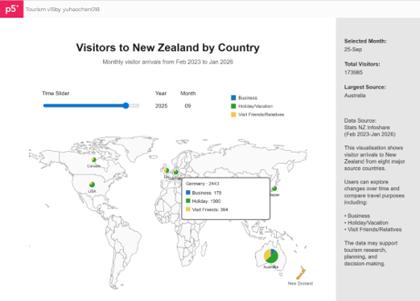
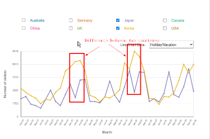

# Week 12

[← Back to Home](../index.md)

# Project Statement

## Visitors to New Zealand by Country

This is an interactive data visualisation design showcasing international visitor statistics for New Zealand. The charts include a world map, pie charts showing visitor demographics by purpose, a time slider, and line graphs illustrating changes in visitor numbers from various countries. Users can explore visitor origins, trends in visitor numbers over time, and differences in travel purposes among visitors from different countries through this visualisation tool.

The primary data for this project comes from the Stats NZ Infoshare database. This online database provides visitor data from February 2023 to January 2026 for eight key source markets. Visitors from each country are further categorised by Business, Holiday/Vacation, and Visiting Friends/Relatives. Supplementary data includes the geographical coordinates of these eight countries and a GeoJSON world map. Tourism statistics are pinpointed on the world map using geographical locations.

This project does not present statistical information through static charts. Instead, complex data is dynamically displayed using various interactive tools. Users can view data for the eight countries for each month using the time slider, and hovering over the pie chart reveals specific data for the selected country. 
By ticking the corresponding country in a checkbox, users can display dynamic line graphs. They can also select different visitor purposes on the line graphs. This interactive approach gives users more autonomy to explore content of interest to them.

The project intends to deliver effective information for various tourism-related users. Tourists can identify peak and off-peak seasons, allowing them to make appropriate choices for when to visit NZ. Tourism is one of NZ’s most important industries. As of March 2025, tourism expenditure was NZ$46.6 billion, accounting for 7.7% of GDP (Stats NZ, 2026). Understanding visitor patterns can help users develop strategic plans. Tour operators can understand seasonal patterns of visitors and key international markets. Accommodation providers can use this data to forecast visitor demand and conduct effective business planning. Government tourism departments can analyse visitor trends in conjunction with economic conditions to create new policies and stimulate visitor spending.

Figure1: Display of tourism data from 8 countries.

Figure2: Difference between Japan and Korea at same month.

The final artefact:
<iframe src="https://editor.p5js.org/yuhaochen018/full/Q9UP5ACBY" width="1000" height="1200"></iframe>

## References

Stats NZ. (2026). Tourism satellite account: Year ended March 2025. Stats NZ. https://www.stats.govt.nz/information-releases/tourism-satellite-account-year-ended-march-2025/
